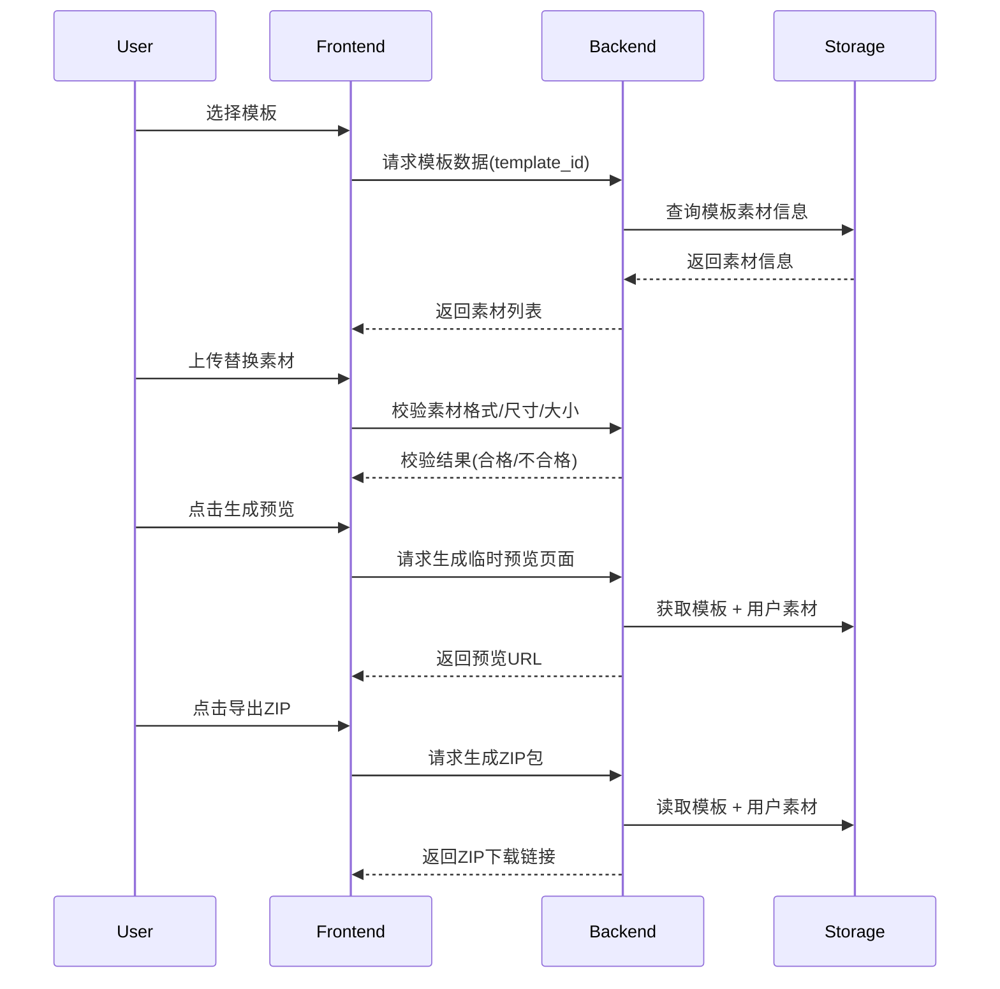

# H5 游戏 SaaS 产品 PRD

## 核心目标 (Mission)

让广告运营人员能够通过可视化方式快速定制并导出 H5 游戏模板，从而节省制作成本和时间。

## 用户画像 (Persona)

* **角色**：广告运营人员（中小型企业市场人员、活动策划方）
* **核心痛点**：

  * 缺乏开发能力，无法自己制作 H5 游戏。
  * 需要快速拿到可上线的成品，用于活动、广告、品牌传播。
  * 希望在模板基础上进行一定程度的个性化定制（素材替换）。

## MVP: 最小可行产品
### 功能
1. **模板选择**：从系统内置模板库中选择一个 H5 游戏模板。
2. **素材替换**：可视化上传图片/音频/视频，严格校验格式、尺寸、大小，页面上显示原始素材信息。
3. **预览生成**：点击“生成预览”按钮后，系统构建并展示可交互的 H5 游戏。
4. **导出功能**：下载完整的 H5 ZIP 包，用户可自行部署。
5. **使用统计**：记录模板使用次数和导出次数。

### 页面设计（与当前实现一致）
1. 顶部导航：[Logo] - [全部模板]
2. 首页：介绍产品功能和特点，引导用户跳转到全部模板页。
3. 全部模板页：展示系统内置模板；支持搜索与分类筛选；模板以卡片形式展示（大屏每行 5 个）；点击卡片进入模板详情页。
4. 模板详情页：
   - 左侧：手机模型中的模板实时试玩预览（iframe，默认竖屏，支持在模型下方切换竖/横文案按钮，横屏按钮置灰不可用）。
   - 右侧：模板标题、描述、标签，以及“素材清单与要求”。素材清单按类型（图片/Gif/音频/视频）分组展示，使用“信息在左、预览在右”的行布局，信息包含 文件名/格式/大小/尺寸。
   - 右上角“去定制”直接创建随机项目并跳转到编辑页面 `/editor/{projectId}?templateId=...&name=...`（不再弹出填写项目名）。
5. 编辑流程采用 3 步导航：编辑素材 → 预览试玩 → 导出广告。
   - 步骤导航固定在编辑域顶部，由 `editor/[projectId]/layout` 控制，仅显示一条。
   - 编辑素材页（`/editor/{id}`）：
     - 单列布局，仅展示素材列表，不含右侧预览。
     - 每个素材行采用“三段式”：左侧“原始信息组件”（名称/要求/文件名在左、预览在右），中间文案“替换为”，右侧“新素材上传与预览”。
     - 所有素材均可不替换，未上传时右侧显示“未上传”。
     - 点击“生成预览”跳转到预览页。
   - 预览试玩页（`/editor/{id}/preview`）：
     - 居中手机模型预览（iframe）；支持返回编辑与进入导出。
   - 导出广告页（`/editor/{id}/export`）：
     - 展示导出说明与“下载 ZIP”按钮；支持返回预览。

## 关键业务逻辑 (Business Rules)

1. 模板库仅包含系统内置模板。
2. 素材替换必须严格符合模板定义的格式/尺寸/大小要求。
3. 预览功能在编辑页点击“生成预览”后跳转到预览页。
4. 导出功能始终输出完整 H5 ZIP 包（当前前端使用 JSZip 生成示例包，后续由后端生成真实构建）。
5. 每次预览/导出操作需计数，用于统计。

## 数据契约 (Data Contract)

* **模板 (Template)**

  * `template_id`
  * `template_name`
  * `assets[]` (素材定义：格式、尺寸、大小限制、占位符路径)

* **用户上传素材 (AssetUpload)**

  * `asset_id`
  * `template_id`
  * `type` (image/audio/video)
  * `format` (jpg/png/mp3/mp4等)
  * `size` (KB/MB)
  * `dimensions` (宽x高)
  * `status` (待校验/合格/不合格)

* **项目 (Project)**

  * `project_id`
  * `template_id`
  * `user_assets[]`
  * `preview_url`
  * `export_zip_path`

* **统计 (Analytics)**

  * `template_id`
  * `preview_count`
  * `export_count`

## 架构设计蓝图

### 核心流程图 (Mermaid sequenceDiagram)

### 组件交互说明

* **前端 (Frontend)**

  * 模板选择界面、素材上传与校验、预览生成与导出按钮
  * 调用 Backend 接口获取模板、上传素材校验、生成预览及导出 ZIP

* **后端 (Backend)**

  * 模板管理服务、素材校验服务、H5 构建服务、数据统计服务
  * 与 Storage 交互存储模板文件、用户素材和生成文件

* **存储 (Storage)**

  * 模板库文件、用户上传素材、临时预览文件、导出 ZIP 包

### 技术选型与风险

* **前端**

  * 框架：Next.js + TypeScript
  * 可视化编辑：HTML5 Canvas
  * UI 组件：shadcn/ui

* **后端**

  * 框架：Python FastAPI
  * H5 生成：模板渲染 + 静态文件打包
  * ZIP 打包：Python zipfile

* **存储**

  * 服务器本地存储

* **潜在风险**

  1. 素材校验严格可能导致上传失败，需要即时前端提示。
  2. H5 构建性能：生成预览和打包 ZIP 过程耗时，需要异步任务 + 临时缓存。
  3. 浏览器兼容性问题。
  4. 用户上传大文件可能导致超时或占用存储，需要限制或压缩策略。

## 未来扩展
1. 可视化调整：支持素材元素拖拽、缩放、旋转。
2. 自动适配：素材上传时自动裁剪/压缩/转码。
