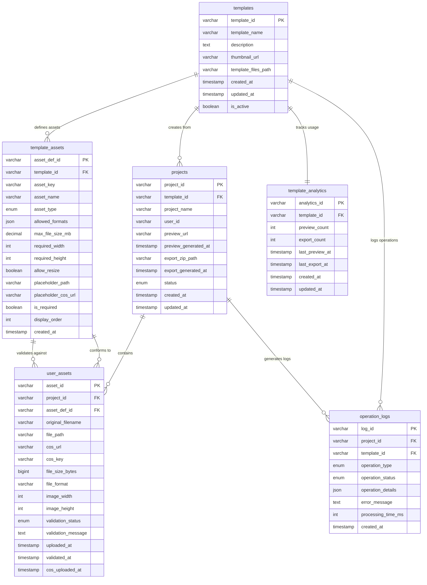

# H5 游戏 SaaS 产品数据库设计

## 设计原则

基于PRD文档的业务需求和数据契约，设计支持以下核心功能的数据库结构：
- 模板管理
- 素材上传与校验
- 项目管理
- 预览与导出
- 使用统计

## 核心实体分析

### 1. 模板 (Template)
- 系统内置的H5游戏模板
- 包含模板基本信息和素材定义规范

### 2. 模板素材定义 (TemplateAsset)
- 定义模板所需的素材规格
- 包含格式、尺寸、大小限制等校验规则

### 3. 用户项目 (Project)
- 用户基于模板创建的项目
- 关联用户上传的素材

### 4. 用户素材 (UserAsset)
- 用户上传的素材文件
- 包含校验状态和文件信息

### 5. 使用统计 (Analytics)
- 记录模板使用情况
- 预览和导出次数统计

## 数据库ER图



## 数据库表结构设计

### 1. templates (模板表)
```sql
CREATE TABLE templates (
    template_id VARCHAR(50) PRIMARY KEY,
    template_name VARCHAR(200) NOT NULL,
    description TEXT,
    thumbnail_url VARCHAR(500),
    template_files_path VARCHAR(500) NOT NULL, -- 模板文件存储路径
    created_at TIMESTAMP DEFAULT CURRENT_TIMESTAMP,
    updated_at TIMESTAMP DEFAULT CURRENT_TIMESTAMP ON UPDATE CURRENT_TIMESTAMP,
    is_active BOOLEAN DEFAULT TRUE,
    INDEX idx_active (is_active),
    INDEX idx_created_at (created_at)
);
```

### 2. template_assets (模板素材定义表)
```sql
CREATE TABLE template_assets (
    asset_def_id VARCHAR(50) PRIMARY KEY,
    template_id VARCHAR(50) NOT NULL,
    asset_key VARCHAR(100) NOT NULL, -- 素材在模板中的标识符
    asset_name VARCHAR(200) NOT NULL, -- 素材显示名称
    asset_type ENUM('image', 'audio', 'video') NOT NULL,
    allowed_formats JSON NOT NULL, -- ["jpg", "png", "gif"]
    max_file_size_mb DECIMAL(10,2) NOT NULL,
    required_width INT,
    required_height INT,
    allow_resize BOOLEAN DEFAULT FALSE,
    placeholder_path VARCHAR(500), -- 默认占位符文件路径
    is_required BOOLEAN DEFAULT TRUE,
    display_order INT DEFAULT 0,
    created_at TIMESTAMP DEFAULT CURRENT_TIMESTAMP,
    FOREIGN KEY (template_id) REFERENCES templates(template_id) ON DELETE CASCADE,
    UNIQUE KEY uk_template_asset_key (template_id, asset_key),
    INDEX idx_template_id (template_id),
    INDEX idx_display_order (display_order)
);
```

### 3. projects (用户项目表)
```sql
CREATE TABLE projects (
    project_id VARCHAR(50) PRIMARY KEY,
    template_id VARCHAR(50) NOT NULL,
    project_name VARCHAR(200) NOT NULL,
    user_id VARCHAR(50), -- 预留用户系统字段
    preview_url VARCHAR(500),
    preview_generated_at TIMESTAMP NULL,
    export_zip_path VARCHAR(500),
    export_generated_at TIMESTAMP NULL,
    status ENUM('draft', 'preview_ready', 'exported') DEFAULT 'draft',
    created_at TIMESTAMP DEFAULT CURRENT_TIMESTAMP,
    updated_at TIMESTAMP DEFAULT CURRENT_TIMESTAMP ON UPDATE CURRENT_TIMESTAMP,
    FOREIGN KEY (template_id) REFERENCES templates(template_id),
    INDEX idx_template_id (template_id),
    INDEX idx_user_id (user_id),
    INDEX idx_status (status),
    INDEX idx_created_at (created_at)
);
```

### 4. user_assets (用户素材表)
```sql
CREATE TABLE user_assets (
    asset_id VARCHAR(50) PRIMARY KEY,
    project_id VARCHAR(50) NOT NULL,
    asset_def_id VARCHAR(50) NOT NULL, -- 关联模板素材定义
    original_filename VARCHAR(255) NOT NULL,
    file_path VARCHAR(500) NOT NULL,
    file_size_bytes BIGINT NOT NULL,
    file_format VARCHAR(20) NOT NULL,
    image_width INT,
    image_height INT,
    validation_status ENUM('pending', 'valid', 'invalid') DEFAULT 'pending',
    validation_message TEXT,
    uploaded_at TIMESTAMP DEFAULT CURRENT_TIMESTAMP,
    validated_at TIMESTAMP NULL,
    FOREIGN KEY (project_id) REFERENCES projects(project_id) ON DELETE CASCADE,
    FOREIGN KEY (asset_def_id) REFERENCES template_assets(asset_def_id),
    UNIQUE KEY uk_project_asset_def (project_id, asset_def_id),
    INDEX idx_project_id (project_id),
    INDEX idx_validation_status (validation_status),
    INDEX idx_uploaded_at (uploaded_at)
);
```

### 5. template_analytics (模板统计表)
```sql
CREATE TABLE template_analytics (
    analytics_id VARCHAR(50) PRIMARY KEY,
    template_id VARCHAR(50) NOT NULL,
    preview_count INT DEFAULT 0,
    export_count INT DEFAULT 0,
    last_preview_at TIMESTAMP NULL,
    last_export_at TIMESTAMP NULL,
    created_at TIMESTAMP DEFAULT CURRENT_TIMESTAMP,
    updated_at TIMESTAMP DEFAULT CURRENT_TIMESTAMP ON UPDATE CURRENT_TIMESTAMP,
    FOREIGN KEY (template_id) REFERENCES templates(template_id) ON DELETE CASCADE,
    UNIQUE KEY uk_template_id (template_id),
    INDEX idx_preview_count (preview_count),
    INDEX idx_export_count (export_count)
);
```

### 6. operation_logs (操作日志表)
```sql
CREATE TABLE operation_logs (
    log_id VARCHAR(50) PRIMARY KEY,
    project_id VARCHAR(50),
    template_id VARCHAR(50),
    operation_type ENUM('preview', 'export', 'asset_upload', 'asset_validation') NOT NULL,
    operation_status ENUM('success', 'failed', 'processing') NOT NULL,
    operation_details JSON, -- 存储操作相关的详细信息
    error_message TEXT,
    processing_time_ms INT,
    created_at TIMESTAMP DEFAULT CURRENT_TIMESTAMP,
    INDEX idx_project_id (project_id),
    INDEX idx_template_id (template_id),
    INDEX idx_operation_type (operation_type),
    INDEX idx_operation_status (operation_status),
    INDEX idx_created_at (created_at)
);
```

## 关键设计说明

### 1. 主键设计
- 使用VARCHAR(50)作为主键，支持UUID或自定义ID格式
- 便于分布式系统扩展

### 2. 素材校验机制
- `template_assets`表定义素材规格要求
- `user_assets`表记录校验状态和结果
- 支持异步校验流程

### 3. 腾讯云COS存储集成
- **模板素材**：`placeholder_cos_url` 存储默认占位符的COS链接
- **用户素材**：`cos_url` 存储用户上传文件的COS链接，`cos_key` 存储COS对象键名
- **文件上传流程**：本地临时存储 → 校验 → 上传到COS → 更新数据库链接
- **存储路径规范**：
  - 模板素材：`templates/{template_id}/{asset_key}.{ext}`
  - 用户素材：`user_assets/{project_id}/{asset_def_id}_{timestamp}.{ext}`

### 4. 统计与监控
- `template_analytics`表聚合统计数据
- `operation_logs`表记录详细操作日志
- 支持性能监控和问题排查

### 5. 扩展性考虑
- 预留`user_id`字段支持用户系统
- JSON字段支持灵活的配置存储
- 索引设计支持常见查询场景
- COS存储支持CDN加速和全球分发

### 6. 数据完整性与文件管理
- 外键约束确保数据一致性
- 唯一约束防止重复数据
- 枚举类型限制状态值范围
- COS对象键名唯一性确保文件不冲突
- 支持文件版本管理和清理策略

## 索引策略

### 查询优化索引
- 模板列表查询：`idx_active`, `idx_created_at`
- 项目管理查询：`idx_template_id`, `idx_user_id`, `idx_status`
- 素材校验查询：`idx_validation_status`
- 统计查询：`idx_preview_count`, `idx_export_count`
- 日志查询：`idx_operation_type`, `idx_created_at`

### 复合索引
- 项目素材唯一性：`uk_project_asset_def`
- 模板素材定义：`uk_template_asset_key`

## 腾讯云COS存储方案

### COS存储结构设计

```
h5-game-saas-bucket/
├── templates/                    # 模板相关文件
│   ├── puzzle_001/              # 拼图游戏模板
│   │   ├── template_files/      # 模板源文件
│   │   ├── placeholder_bg.jpg   # 默认背景占位符
│   │   └── placeholder_music.mp3 # 默认音乐占位符
│   └── memory_001/              # 记忆游戏模板
│       └── ...
├── user_assets/                 # 用户上传素材
│   ├── project_001/            # 项目ID目录
│   │   ├── asset_def_bg_20240101120000.jpg
│   │   └── asset_def_music_20240101120000.mp3
│   └── project_002/
└── exports/                    # 导出文件
    ├── project_001_20240101.zip
    └── project_002_20240101.zip
```

### 文件上传与管理流程

1. **用户素材上传流程**：
   ```
   用户选择文件 → 前端预校验 → 临时上传到服务器
   → 后端详细校验 → 上传到COS → 更新数据库记录 → 删除临时文件
   ```

2. **COS对象键命名规范**：
   - 模板素材：`templates/{template_id}/{asset_key}.{ext}`
   - 用户素材：`user_assets/{project_id}/{asset_def_id}_{timestamp}.{ext}`
   - 导出文件：`exports/{project_id}_{export_timestamp}.zip`

3. **文件生命周期管理**：
   - 临时文件：24小时后自动清理
   - 用户素材：项目删除时级联删除
   - 导出文件：30天后自动归档

### COS配置建议

- **存储类型**：标准存储（用户素材）+ 低频存储（模板文件）
- **CDN加速**：开启全球CDN加速，提升访问速度
- **访问权限**：私有读写，通过签名URL提供访问
- **备份策略**：开启版本控制，定期跨地域备份
- **监控告警**：配置存储容量、请求量、错误率监控
